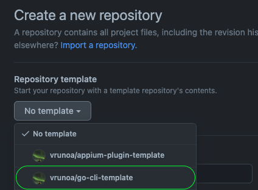

# go-cli-template

A template for building CLIs in Golang based on [Cobra](https://github.com/spf13/cobra)

## Usage

When creating a new repository, pick this repository as template



## Features

This basic repo contains:

* A basic cli setup with a single subcommand using a flag
```
A CLI written in Go

Usage:
  go-cli-template [command]

Available Commands:
  completion  Generate the autocompletion script for the specified shell
  hello       say hello
  help        Help about any command

Flags:
  -h, --help   help for go-cli-template

Use "go-cli-template [command] --help" for more information about a command.

```

* Github workflows for:
  * Lint, using [golangci-lint](https://golangci-lint.run/)
  * Unit test with code coverage using [goverreport](https://github.com/mcubik/goverreport)
  * Build pipeline, storing artifacts to Github
  * Release pipeline, using [goreleaser](https://goreleaser.com/) triggered on tags and pushing to Github releases. 


* Basic logging, using [zerolog](https://github.com/rs/zerolog)
